# Juan Marcos Bruno

Senior/Lead Software Engineer · **[Connect on LinkedIn](https://www.linkedin.com/in/juanmarcosbruno/)** · [ML Quest, my interactive ML portfolio](https://jmb-python-developer.github.io/)

## Featured Projects

- **[Fever Plans API](https://github.com/jmb-python-developer/events-api-kotlin-spring-boot)** — Spring Boot + Kotlin events API built with Hexagonal Architecture, DDD, and CQRS.
- **[Events API Architecture](https://github.com/jmb-python-developer/events-api-architecture)** — Architecture design for a generic events solution across collaborating microservices.
- **[FastAPI AWS Microservice](https://github.com/jmb-python-developer/python-fastAPI-aws-microservices)** — Python microservice with a DevOps-first focus: CI/CD pipeline and AWS deployment.
- **[Video-to-Sound Microservices](https://github.com/jmb-python-developer/video-to-sound-microservices)** — Microservices architecture for extracting and manipulating audio from video files.

## Machine Learning

Coming from 15 years of software engineering, currently building ML depth deliberately — coursework first, then applied end-to-end projects, each one deeper than the last.

**Coursework:**
- Coursera / Stanford [Machine Learning Specialization](https://coursera.org/share/6b49f68cc5effbe5bb3e7d13ef44b524):
  - [Supervised Machine Learning: Regression and Classification](https://coursera.org/share/48ee7076fd82e9ee42f1a4c788a44fcb)
  - [Advanced Learning Algorithms](https://coursera.org/share/a6e47389a43a12f003efebdff40f9340)
  - [Unsupervised Learning, Recommenders, Reinforcement Learning](https://coursera.org/share/a1497bcee3e8886e066ca9f1e3abe669)
- IBM (Coursera) certifications:
  - [Python for Data Science, AI & Development](https://coursera.org/verify/ZM7GAUJNFYFE) — April 2025
  - [Exploratory Data Analysis for Machine Learning](https://coursera.org/account/accomplishments/verify/KER2N0IYGON5) — July 2025

### ML Quest

Each level is harder and more structured than the last, moving step by step toward production-ready machine learning: clean pipelines, tuned models, and models served as real services.

Click a level below to see what it covered, or open the <a href="https://jmb-python-developer.github.io/">interactive map</a>.

<b>✅ Level 1.0 · Exam Score Predictor</b> — Cleared

**Mission:** Predict a student's exam score from five everyday habits: study hours, attendance, sleep, mental health and part-time work.

**Result:** Predictions land within about 7 points on a 0–100 score, and the model explains 81% of the variation between students.

**Learned:**
- The full pipeline once, end to end: explore the data, build features, compare models, ship an app
- Judging models against a simple baseline, so scores mean something
- Keeping the test set untouched until the very end

**Skills:** `Python` · `pandas` · `scikit-learn` · `Regression` · `Cross-validation` · `Streamlit app`

[Open the project ↗](https://github.com/jmb-python-developer/ML-01-exam-scores-prediction)

<b>✅ Level 1.2 · Customer Churn Prediction</b> — Cleared

**Mission:** Predict which of a bank's 10,000 customers are about to leave, using account and demographic data.

**Result:** When the best model flags a customer as leaving, it is right about 3 times out of 4. It finds about half of the customers who actually leave.

**Learned:**
- Backing up what the charts suggest with statistical tests
- Why accuracy misleads when most customers stay
- Comparing five different models fairly and picking one on evidence

**Skills:** `Classification` · `Hypothesis testing` · `Feature scaling` · `Pipelines` · `Precision & recall` · `5-model comparison`

[Open the project ↗](https://github.com/jmb-python-developer/ML-02-customer-churn-prediction)

<b>⭐ Level 1.3 · Credit Risk Scoring</b> — In progress

**Mission:** Predict which loan applicants will default, and tune the models so they catch more of the risky ones.

**Result:** In progress.

**Will learn:**
- Tuning models instead of accepting their defaults
- Handling data where the important cases are the rare ones
- Choosing the decision cut-off on purpose, based on the cost of each kind of mistake

**Skills:** `Hyperparameter tuning` · `Random forest` · `XGBoost` · `Class imbalance` · `Threshold tuning`

🔒 *Repository private until this level is cleared.*

<b>🔒 Level 1.4 · Model Serving</b> — Locked

**Mission:** Turn the 1.3 model into a web service that other software can call, packaged so it runs anywhere.

**Will learn:**
- Moving from a notebook to a real, repeatable training script
- Serving predictions through an API that rejects bad input
- Packaging the service in a container

**Skills:** `FastAPI` · `REST API` · `Docker` · `Deployment`

**How I use AI.** I write the modelling code and make the analysis decisions myself: what to explore, which models to compare, how to evaluate them and what the results mean. I use LLMs the way I would on any engineering team: to scaffold projects, handle repetitive boilerplate, talk through concepts, and draft documentation and tooling (including this page), which I review and edit before it ships.
